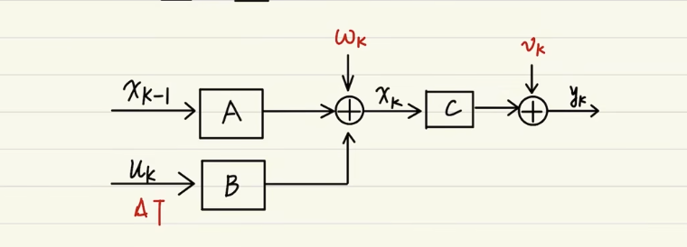
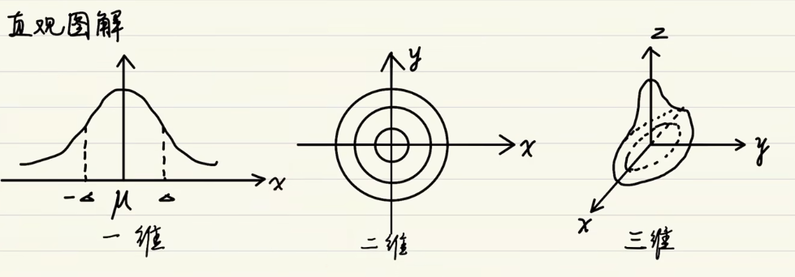
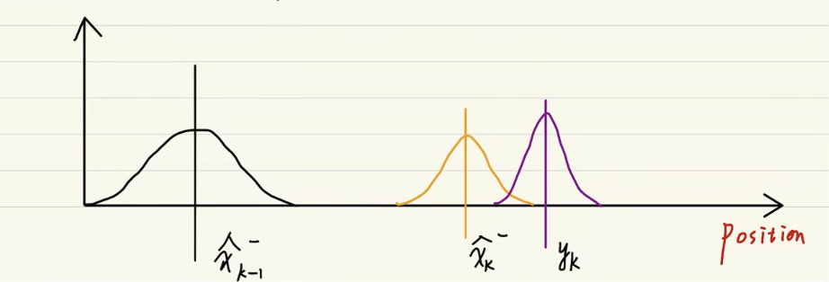
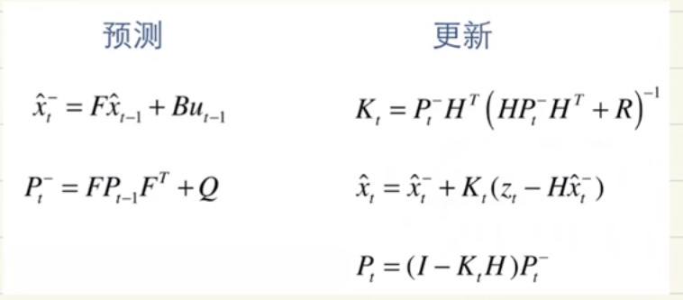
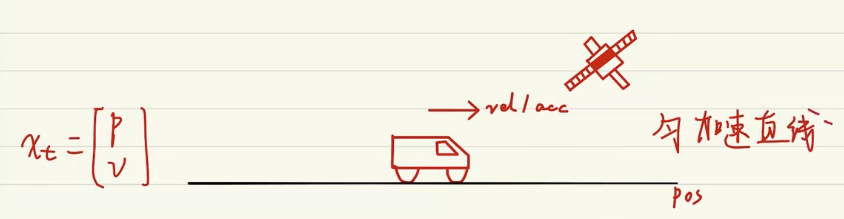

# kalman 滤波

## 概述

适用系统:

- 线性系统
- 噪声满足高斯噪声

## 原理解释

### 状态空间表达式

- 状态方程

$$ x_k = A x_{k-1} + B \mu_k + w_k $$
其中, $\mu$ 为控制输入，$w$ 为过程噪声，满足高斯分布
- 观测方程

$$ y_k = C x_k + \upsilon_k $$
其中，$\upsilon$ 为观测噪声，满足高斯分布

### 高斯分布

### 参数分析
过程噪声和观测噪声，均符合高斯分布
$$ w_k \in N(0;Q_k) $$
$$ \upsilon_k \in N(0;R_k) $$

$R_k$, $Q_k$ 均为噪声的协方差，两者为超参数

### kalman直观图解

## 通俗公式理解
通俗理解，使用上一次的最优结果预测当前的值，同时使用观测值修正当前值，得到最优的结果

思考一辆行驶在路上的小车

> 简化为一个均加速直线运动

建模：
$$ p_i = p_{i-1} + v_{i-1} * \varDelta t + \frac{a}{2} {\varDelta t}^2 $$
$$ v_i = v_{i-1} + a \varDelta t $$

### 先验估计计算

$$ \hat{x}_i^- = F \hat{ x }_{i-1} +B \mu_{i-1}  + w_t $$

> $w_t$ 为误差

上述建模写成矩阵形式:
$$ \begin{bmatrix}
  p_i \\ 
  v_i
\end{bmatrix} = \begin{bmatrix}
   1 & \varDelta t \\
   0 & 1
\end{bmatrix}  \begin{bmatrix}
  p_{-1} \\
  v_{i-1}
\end{bmatrix} + \begin{bmatrix}
  \frac{ {\varDelta t}_2  }{ 2} \\ 
  \varDelta t
\end{bmatrix} a_i               $$

其中， $F =  \begin{bmatrix}
   1 & \varDelta t \\
   0 & 1
\end{bmatrix}$, $B=\begin{bmatrix}
  \frac{ {\varDelta t}_2  }{ 2} \\ 
  \varDelta t
\end{bmatrix}$, $u_i = a_i$，为控制激励

### 先验估计协方差的计算

$$ P_t^- = F P_{t-1} + Q $$

- 推导
 $$ \begin{align}
 cov(  \hat{x}_t^-, \hat{x}_t^-  ) 
 &= cov( F \hat{ x }_{i-1} +B \mu_{i-1} + w_t, F \hat{ x }_{i-1} +B \mu_{i-1} + w_t ) \\
 &= F cov(\hat{ x }_{i-1}, \hat{ x }_{i-1}) F_{T} + cov( w_t,  w_t)
\end{align}
 $$
其中 $P_{t-1} =cov(\hat{ x }_{i-1}, \hat{ x }_{i-1})$ ， $Q=cov( w_t,  w_t)$

> 针对 $\hat{x}_t^-$的先验估计协方差

### 测量方程

$$ z_t = H x_t + \upsilon $$

> z的维度可能和x不一致

上述小车的测量模型是什么？

$$ z_p = p_t + \varDelta p_t $$
$$ z_v = 0 $$

矩阵形式为
$$ \begin{bmatrix}
  z_p \\
  z_v
\end{bmatrix}  = \begin{bmatrix}
  1 & 0
\end{bmatrix} \begin{bmatrix}
  p_t \\ v_t
\end{bmatrix} + \begin{bmatrix}
  1 & 0
\end{bmatrix}  \begin{bmatrix}
  \varDelta p_t \\ \varDelta v_t
\end{bmatrix} 
$$

即 $H = \begin{bmatrix}
  1 & 0
\end{bmatrix}$

### 更新卡尔曼增益

$$ k_t = \frac{ p_t^2 H^T }{ H P_t^- H^T + R } $$

> R 为观测误差协方差矩阵, $cov(\upsilon,\upsilon)$

### 修正估计

$$ \hat{x}_t = \hat{x}_t^- + K_t(z_t - H \hat{x}_t^-) $$

### 更新后验估计误差

$$ P_t = (I - K_t H) P_t^- $$

## 调节超参数

### Q 与 R 的取值

公式层面理解

从 

$$ P_t^- = F P_{t-1} + Q $$
$$ k_t = \frac{ p_t^2 H^T }{ H P_t^- H^T + R } $$

得

$$ K = \frac{ P_{t-1} + Q}{ P_{t-1} + Q + R } $$

结合

$$ \hat{x}_t = \hat{x}_t^- + K_t(z_t - H \hat{x}_t^-) $$

- 如果信任观测值 Q 大一些，R 小一些
- 反之，R 大一些，Q 小一些

### $P_0$ $x_0$ 的取值

习惯 $p_0$ 取1 （不取0） ， $x_0$ 取 0

